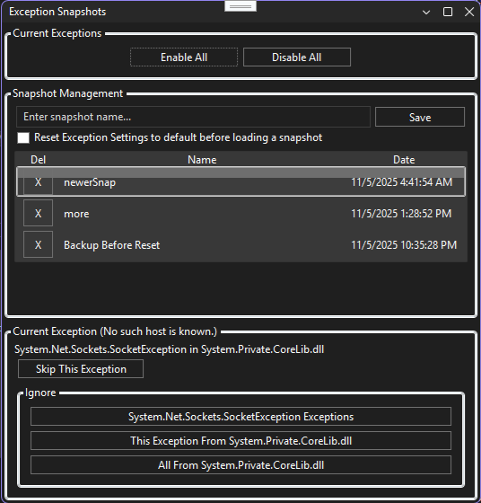

# Exception Snapshot Extension


## Overview

Exception Snapshot is a Visual Studio extension that helps you manage the "BreakOnFirstChance" setting for individual exceptions or groups of exceptions with ease. It provides a dedicated tool window for saving, and restoring exception break settings, making debugging more efficient and organized.  It stores the conditions along with their enabled states.

## TOC
<!-- TOC -->
- [Features](#features)
- [Screenshot](#screenshot)
- [Installation](#installation)
	- [From Visual Studio Marketplace](#from-visual-studio-marketplace)
	- [Manual Build & Install](#manual-build--install)
- [Usage](#usage)
- [Development & Contribution](#development--contribution)
	- [Prerequisites](#prerequisites)
	- [Build Instructions](#build-instructions)
	- [Contributing](#contributing)
- [License](#license)

<!-- /TOC -->

## Features

- Manage "BreakOnFirstChance" for specific exceptions or exception groups
- Visual Studio tool window for snapshot management
- Save and restore exception break settings
- Live exception controls to handle exceptions as they occur during debugging
- Quickly ignore current exception, or all exceptions from a module, right from the exception break tool window
- Easy-to-use UI integrated into Visual Studio

## Screenshot



## Installation

### From Visual Studio Marketplace

1. Open Visual Studio
2. Go to `Extensions > Manage Extensions`
3. Search for **Exception Snapshot**
4. Click `Download` and restart Visual Studio to complete installation

### Manual Build & Install

1. Clone this repository:
	```pwsh
	git clone https://github.com/VladimirUAZ/ExceptionSnapshotExtension.git
	```
2. Open `ExceptionSnapshotExtension.sln` in Visual Studio
3. Build the solution (`Build > Build Solution`)
4. Run debugger:)

## Usage

1. After installation, open Visual Studio and load your solution/project.
2. Go to `Debug > Windows > Exception Snapshots` (or use the command added to the menu).
3. Use the tool window to manage exception break settings:
	- View current snapshots
	- Save snapshots of your exceptions
	- Restore previous snapshots as needed (double click on a snapshot to restore)
	- Delete snapshots by hitting the X to the left of it
- When an exception is hit during debugging, the "Current Exception" panel will appear at the bottom of our window.
	- **Skip This Exception**: Continue execution without breaking.
	- **Ignore**: Add rules to ignore this exception type, exceptions from the same module, or all exceptions from that module in the future.


## Development & Contribution

### Prerequisites
- Visual Studio 2017 or newer
- .NET Framework 4.5 or higher

### Build Instructions
1. Clone the repository
2. Open the solution in Visual Studio
3. Build the project

### Contributing
Pull requests and issues are welcome! Please open an issue to discuss your ideas or submit a PR for review.

## License

This project is licensed under the MIT License. See [LICENSE](LICENSE) for details.
